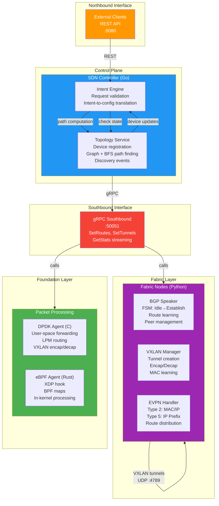

# Chakraview Networking-SDN Architecture

## Overview

Three-layer architecture for SDN portfolio project:

## Data Flow Example

### Device Registration
1. Fabric node calls gRPC `RegisterDevice()`
2. Controller adds to topology graph
3. Discovery service emits `device.registered` event
4. Topology becomes queryable via REST `/api/v1/topology/devices`

### Route Advertisement
1. BGP speaker learns route from peer
2. gRPC `AdvertiseBgpRoute()` to controller
3. Policy engine translates to forwarding rules
4. Foundation layer (DPDK/eBPF) installs rules
5. Packets forwarded per installed rules

## Technology Stack

| Layer | Component | Language | Port |
|-------|-----------|----------|------|
| Control | SDN Controller | Go | 8080 (REST), 9090 (gRPC) |
| Fabric | BGP/VXLAN/EVPN | Python | gRPC client |
| Foundation | DPDK | C | Userspace |
| Foundation | eBPF | Rust + C | Kernel |
| Lab | Docker Compose | YAML | Local |

## Extensibility

- **Add Protocol:** Implement gRPC handler in controller, Python client in fabric node
- **Add Device Type:** Extend NetworkDevice class with custom role behavior
- **Add Policies:** Define new PolicyIntent types, translators in policy engine
- **Add Foundation Layer:** Parallel user/kernel implementations compared
