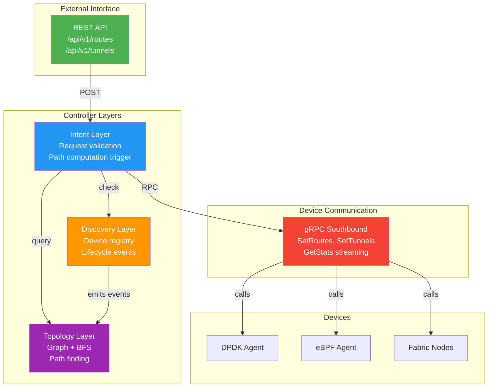

# Controller Layer Guide — Intent-Driven Network Management

## Overview

The SDN controller is the "brain" that translates operator intent into device configuration. An operator says "I want traffic to flow from subnet A to subnet B" and the controller computes the path, installs routes on intermediate devices, and monitors the network for failures.

The controller has three main responsibilities:

1. **Topology Discovery** — Learn what devices exist and how they are connected
2. **Path Computation** — Find shortest paths through the network
3. **Intent Fulfillment** — Accept configuration requests and push to devices

## Architecture

The controller is structured in three layers:



Each layer is independently testable:
- **Topology**: Test with mock devices (no network I/O)
- **Discovery**: Test device registration/failure events
- **Intent**: Test request validation and path computation
- **Transport**: Mock gRPC calls for unit testing

## Topology Service

The topology service maintains an in-memory graph of devices and links:

```go
type Device struct {
    ID string              // "dpdk-agent-1"
    IP string              // "10.0.0.1"
    Capabilities []string  // ["ipv4-forwarding", "vxlan"]
}

type Link struct {
    Source, Target string  // Device IDs
    Cost int              // Hop count (always 1 for now)
}

type Topology struct {
    devices map[string]*Device
    links   map[string]*Link
    lock    sync.RWMutex  // Protects graph during concurrent updates
}
```

**Path Computation:**

Uses BFS (Breadth-First Search) to find shortest path:

1. Start at source device
2. Visit neighbors with cost +1
3. Stop when destination reached
4. Backtrack to build path: [source, hop1, hop2, destination]

**Immutable Snapshots:**

To avoid race conditions, take a snapshot of the graph before path computation:

```go
snapshot := topology.Snapshot()  // Copy graph at this instant
path := snapshot.ShortestPath(src, dst)
// Path computation uses snapshot; concurrent device updates don't affect it
```

## Discovery Service

The discovery service detects when devices come online and go offline.

**Device Registration:**

1. Device starts, calls gRPC `RegisterAgent` RPC
2. Controller receives registration, extracts device ID and capabilities
3. Discovery service emits `DeviceRegistered` event
4. Topology service consumes event, adds device to graph
5. Intent service can now push routes to this device

**Device Failure:**

When a device doesn't respond to health checks (e.g., heartbeat timeout), discovery emits `DeviceFailed` event. Topology recomputes paths around the failed device.

## Intent Service

The intent service accepts requests from operators via REST API and translates them to gRPC calls to devices.

**REST Endpoints:**

```
POST /api/v1/routes
{
  "source_subnet": "10.0.0.0/24",
  "dest_subnet": "10.1.0.0/24",
  "tunnel_id": 1
}
```

Intent service:
1. Validates the request (subnets exist, tunnel exists)
2. Calls `topology.ShortestPath(src_device, dest_device)`
3. For each hop, calls device's gRPC `SetRoutes` RPC
4. Returns success or failure

**Configuration Consistency:**

If installation fails midway (e.g., second hop rejects route), intent service should either:
- **Rollback**: Remove routes from already-installed devices
- **Retry**: Wait and try again (simple for lab, risky for production)

Current implementation uses simple retry (marked EXTENSION for proper rollback).

## Integration with Fabric Devices

The controller communicates with fabric devices (simulated BGP speakers, VXLAN tunnels) via the same gRPC interface as DPDK/eBPF agents.

When a fabric device registers, the controller can:
1. Query its peer list via `GetStats`
2. Install routes via `SetRoutes`
3. Create tunnels via `SetTunnels`

This allows the controller to manage the entire three-layer system uniformly.

## Extending the Controller

### Add a New Intent Type

To add a new intent (e.g., QoS rate-limiting):

1. Define REST endpoint in `cmd/sdn-controller/main.go`
2. Implement handler in `pkg/intent/intent.go`
3. Translate to gRPC calls to agents

### Add Persistent State

Current topology is in-memory; survives only while controller runs. To add persistence:

1. Add `pkg/store/store.go` with interface for Get/Set/Delete
2. Implement with etcd, PostgreSQL, or Redis
3. Load topology from store on startup
4. Write topology changes to store on update

### Add Multi-Hop Path Optimization

Current implementation installs routes on every hop. For efficiency:

1. Modify path computation to return path
2. Only install routes on edge devices (ingress/egress)
3. Let fabric internal routing handle middle hops

## Performance Characteristics

- **Path computation**: O(V + E) BFS, where V = devices, E = links. ~100 microseconds for 100-device topology
- **Route installation**: Parallel gRPC calls to all affected devices. ~100 milliseconds for 10-device path (10ms per RPC)
- **Discovery**: Event-driven; <1 millisecond latency for detection (polling would add delays)

## Testing the Controller

Run unit tests:

```bash
cd controller
go test ./...
```

Run integration tests with lab:

```bash
make lab-up
curl http://localhost:8080/api/v1/health
```

## Next Steps

- [Integration with Fabric Protocols](fabric-layer.md) — How controller manages fabric devices
- [ADR-0004: Controller Architecture](../adrs/0004-go-controller-design.md) — Design rationale
- [ADR-0003: Southbound Protocol](../adrs/0003-grpc-southbound.md) — gRPC interface details
