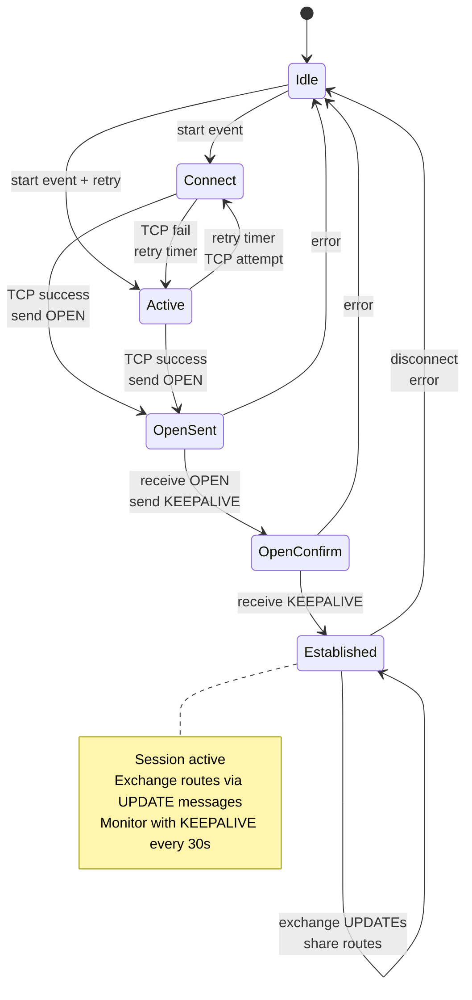
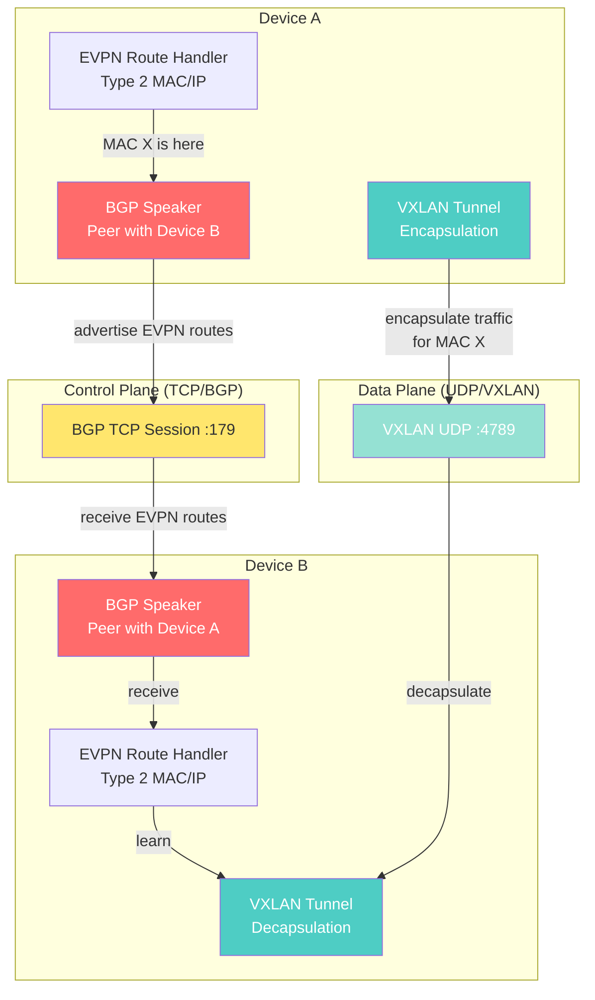

# Fabric Layer Guide — BGP, VXLAN, and EVPN

## Overview

The fabric layer implements the protocols that network devices use to communicate with each other and reach consensus on routing state.

Three complementary protocols form the modern datacenter fabric:

| Protocol | Function | Example |
|----------|----------|---------|
| **BGP** | Route distribution | "Subnet 10.1.0.0/24 is reachable via router-1" |
| **VXLAN** | Virtual overlay tunneling | "Packet destined for VM in VLAN 100 goes through tunnel 42" |
| **EVPN** | Virtual networking at scale | "MAC address 02:11:22:33:44:55 is behind tunnel 42 in VLAN 100" |

The fabric operates autonomously: devices discover each other, establish peering sessions, and coordinate state without controller involvement. The controller observes the fabric (queries routes) but does not orchestrate it in detail.

## BGP (Border Gateway Protocol)

BGP is a path-vector routing protocol: each device advertises "I can reach these subnets, and here's the path" and neighbors propagate this information across the network.

### BGP Finite State Machine (FSM)

A BGP session between two devices progresses through states:



**Key State Details:**

- **Idle**: No connection attempt. Wait for manual start or automatic retry timer.
- **Connect**: TCP connection in progress. Move to OpenSent when connection succeeds.
- **Active**: TCP connection failed; retrying. Alternate with Connect if retry timer expires.
- **OpenSent**: TCP connected; sent BGP OPEN message. Wait for peer's OPEN response.
- **OpenConfirm**: Received peer's OPEN; sent KEEPALIVE. Wait for peer's KEEPALIVE.
- **Established**: Session active; can exchange UPDATE messages (routes).

### Route Advertisement

In the Established state, devices exchange UPDATE messages:

```
UPDATE {
  "withdrawn_routes": [],
  "path_attributes": {
    "next_hop": "10.0.0.1",
    "as_path": [65001],
    "local_pref": 100
  },
  "nlri": ["10.1.0.0/24", "10.2.0.0/24"]  // Networks being advertised
}
```

On receiving UPDATE:
1. Validate attributes (AS path, next hop reachable)
2. Select best path (lowest AS path length, then by local preference)
3. Install in forwarding table
4. Re-advertise to other peers (route propagation)

### Extending BGP

- **Add route dampening**: Suppress routes that flap (up/down) frequently to prevent instability
- **Add MED (Multi-Exit Discriminator)**: Allow peer to influence traffic engineering ("prefer path via this exit point")
- **Add route filtering**: Drop routes from certain AS paths or to certain destinations

## VXLAN (Virtual Extensible LAN)

VXLAN creates virtual Layer 2 networks over Layer 3 IP infrastructure. It solves the problem: "How do VMs in different physical locations appear to be on the same Layer 2 network?"

### Encapsulation

```
Original Packet:  [Eth: dst=VM2] [IP] [Data]
VXLAN Wrapped:    [Eth] [IP] [UDP] [VXLAN] [Original Eth] [IP] [Data]
```

The VXLAN header:
```
0         1         2         3
0 1 2 3 4 5 6 7 8 9 0 1 2 3 4 5 6 7 8 9 0 1 2 3 4 5 6 7 8 9 0 1
+-+-+-+-+-+-+-+-+-+-+-+-+-+-+-+-+-+-+-+-+-+-+-+-+-+-+-+-+-+-+-+-+
|R|R|R|R|I|R|R|R|            Reserved                           |
+-+-+-+-+-+-+-+-+-+-+-+-+-+-+-+-+-+-+-+-+-+-+-+-+-+-+-+-+-+-+-+-+
|                VXLAN Network Identifier (VNI) [24 bits]       |
+-+-+-+-+-+-+-+-+-+-+-+-+-+-+-+-+-+-+-+-+-+-+-+-+-+-+-+-+-+-+-+-+
```

VNI (24 bits) identifies the virtual network. Packets with VNI=100 belong to one virtual network; VNI=101 to another.

### Tunnel State

Each device maintains tunnel configuration:

```python
class Tunnel:
    tunnel_id: int           # 1-100 in lab
    vni: int                 # 0-16M (VXLAN identifier)
    remote_endpoint: str     # IP address of other end
    local_endpoint: str      # This device's IP
    encapsulation: "vxlan"
```

When sending traffic destined for a remote VM:
1. Lookup tunnel for that VM's VNI
2. Encapsulate packet with VXLAN header
3. Send to remote endpoint

When receiving VXLAN traffic:
1. Decapsulate (remove outer headers)
2. Extract VNI and original packet
3. Forward based on original destination MAC

### Extending VXLAN

- **Add VXLAN Group Policy extension**: Tag packets with policy ID for fine-grained filtering
- **Add multicast replication**: Support VXLAN groups for broadcast/multicast from VM
- **Add dynamic MAC learning**: Snoop on data plane traffic to learn MAC → tunnel mappings (instead of static config)

## EVPN (Ethernet VPN)

EVPN solves a critical problem: in large VXLAN networks, how do devices know which tunnel carries traffic to a given MAC address?

Static configuration (device knows "MAC X is behind tunnel 1") doesn't scale. EVPN uses BGP to advertise MAC/IP bindings:

```
EVPN Route Type 2 (MAC/IP Advertisement):
  Route Target: 65001:100           # Community (defines VRF)
  Extended Communities: Encap=VXLAN  # Overlay tech
  NLRI: MAC=02:11:22:33:44:55, IP=10.1.0.42, Label=42
        ↑ This device owns this MAC in VXLAN VNI 42
```

When device-A receives this route, it learns: "To reach MAC 02:11:22:33:44:55, use tunnel to device-B."

### Route Types

- **Type 2 (MAC/IP)**: "This MAC+IP is behind this device in this VNI"
- **Type 5 (IP Prefix)**: "This subnet is reachable via this device"

Type 2 enables MAC mobility (VM migration): if VM moves to a different device, device-B advertises the new route and device-A learns the new tunnel endpoint.

### Integration with BGP and VXLAN

```
BGP carries EVPN routes
    ↓
Device learns "MAC X is behind tunnel to device-B"
    ↓
When device-A needs to send to MAC X:
  1. Lookup tunnel endpoint from EVPN route
  2. Encapsulate with VXLAN (VNI from EVPN route)
  3. Send to device-B's IP address
```

## Simulated Devices

The lab uses Python simulated devices that implement all three protocols:

```python
class NetworkDevice:
    def __init__(self, name, asn):
        self.bgp_speaker = BGPSpeaker(asn=asn)
        self.vxlan_tunnels = {}
        self.evpn_routes = {}
        self.forwarding_table = {}
```

Devices:
1. Establish BGP peering (TCP to configured peers)
2. Exchange BGP routes
3. Advertise EVPN routes for locally-attached VMs
4. Update forwarding table based on learned routes

## Extending the Fabric

### Add a Device Type

1. Create new device class inheriting from `NetworkDevice`
2. Implement `BGPSpeaker` (if device speaks BGP)
3. Implement `VXLANTunnel` management
4. Register with controller via gRPC `RegisterAgent`

### Add Route Dampening

When a device flaps (up/down rapidly), silence its advertisements temporarily:

1. Track route state changes (time, count)
2. Calculate penalty score (resets over time)
3. Suppress route when score exceeds threshold

### Add EVPN Type 5 (Prefix) Routes

Enable IP-only advertising (no MAC-based routes):

1. Define Type 5 route structure
2. Parse from BGP UPDATE messages
3. Install in IP forwarding table (not MAC table)

## Integration: BGP + VXLAN + EVPN

The three protocols work together to provide complete fabric networking:



**Data flow:**
1. Device A announces: "MAC 02:11:22:33:44:55 is behind me in VNI 42" via EVPN route
2. BGP carries this route to Device B over TCP session
3. Device B learns: "To reach that MAC, send VXLAN traffic with VNI 42 to Device A"
4. When traffic arrives for that MAC, Device B encapsulates in VXLAN and sends to Device A
5. Device A decapsulates and delivers to the VM

## Integration with Controller

The controller can:

1. **Observe fabric state**: Query device statistics (`GetStats` RPC) to see BGP peer status, route count
2. **Inject configuration**: Send static routes via `SetRoutes` RPC (overrides dynamic BGP)
3. **Create tunnels**: Call `SetTunnels` to manually establish VXLAN tunnels (useful for testing)

This allows the controller to override dynamic fabric decisions when needed (e.g., traffic engineering).

## Performance Expectations

- **BGP convergence time**: ~1 second for small topologies (10 devices)
- **VXLAN encapsulation overhead**: 50 bytes per packet
- **EVPN route processing**: ~100 milliseconds to process large route batch

These are educational targets, not production benchmarks.

## Testing the Fabric

Run fabric tests:

```bash
cd fabric
python -m pytest tests/
```

Run integration tests with lab:

```bash
make lab-up
# Fabric devices should establish BGP peers and exchange routes
docker logs fabric-node-1
```

## Next Steps

- [Lab Setup and Integration](lab-setup.md) — How all layers work together
- [ADR-0005: BGP/VXLAN/EVPN](../adrs/0005-bgp-vxlan-evpn.md) — Architecture decisions
- [ADR-0004: Controller Integration](../adrs/0004-go-controller-design.md) — How controller manages fabric
