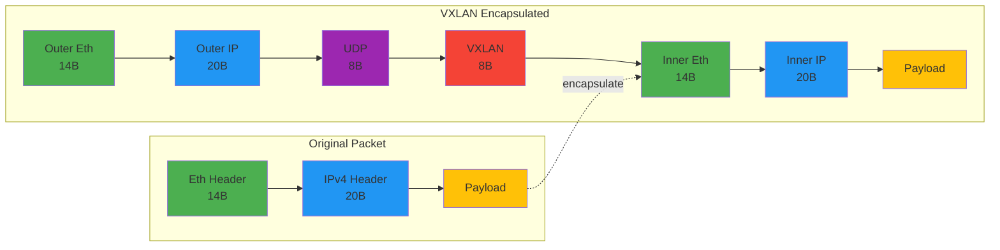
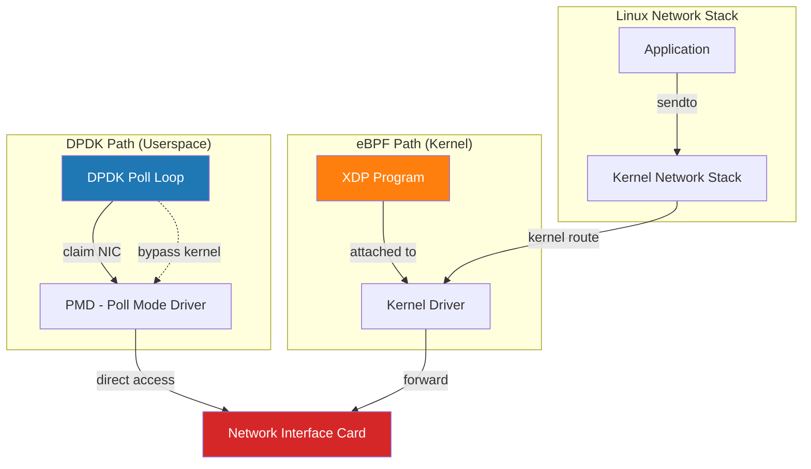

# Foundation Layer Guide — DPDK and eBPF Packet Processing

## Overview

The foundation layer is the lowest level of the SDN stack: the systems software that actually moves packets. It exists in two forms:

1. **DPDK (Data Plane Development Kit)** — A userspace packet processing library that takes direct control of the NIC, bypasses the kernel, and processes packets in tight polling loops
2. **eBPF (extended Berkeley Packet Filter)** — A kernel virtual machine for networking; attaches to kernel hooks (XDP) and processes packets with kernel scheduling

Both implementations expose the same gRPC interface to the controller (`RegisterAgent`, `SetRoutes`, `SetTunnels`, `GetStats`), so the lab can swap implementations without changing the control plane.

## DPDK Implementation

### Architecture

The DPDK implementation is a single-threaded application in C that:

1. Initializes the DPDK environment and claims a NIC
2. Runs a polling loop: fetch packets from RX ring → forward → send to TX ring
3. Maintains a forwarding table (routes) and tunnel state
4. Exposes gRPC interface for route/tunnel updates

**Files:**
- `foundation/dpdk/src/forwarding.{h,c}` — LPM routing engine
- `foundation/dpdk/src/vxlan.{h,c}` — VXLAN tunnel encapsulation/decapsulation
- `foundation/dpdk/src/main.c` — Main loop and initialization

### Forwarding Engine

The forwarding engine implements Longest Prefix Match (LPM) routing:

```c
struct route {
    uint32_t dest_ip;      // Network address (e.g., 10.0.0.0)
    uint32_t mask;         // CIDR mask (e.g., /24 = 0xffffff00)
    uint32_t next_hop;     // Gateway to send to
    uint16_t egress_port;  // Physical port number
};
```

To forward a packet:
1. Extract destination IP from packet header
2. Iterate all routes, find all matches: `(dest_ip & mask) == (route_ip & mask)`
3. Select the one with longest prefix (highest bit count in mask)
4. Encapsulate if tunnel exists, forward to egress port

### VXLAN Tunneling

VXLAN wraps Layer 2 frames in UDP packets for virtual networking:



The encapsulation adds **50 bytes of overhead** (14+20+8+8 = 50B outer headers). Decapsulation validates buffer sizes to prevent overflow.

### Extending DPDK

To add a new feature to DPDK:

1. **Add a new forwarding rule type** (QoS, filtering):
   - Modify `forwarding.h` to add rule structure
   - Implement matching logic in `forwarding.c`
   - Update `main.c` to populate rules from gRPC `SetRoutes` RPC

2. **Add multicore support**:
   - Replace single polling loop with thread pool (EXTENSION point marked in main.c)
   - Partition routes by hash(dest_ip) to reduce lock contention

3. **Add statistics collection**:
   - Add counters in the route struct (bytes sent, packets dropped)
   - Expose via `GetStats` gRPC RPC

## eBPF Implementation

### Architecture

The eBPF implementation is a kernel-attached program in Rust that:

1. Loads an XDP program onto the NIC driver
2. Intercepts packets before kernel network stack processes them
3. Uses BPF maps (in-kernel key/value stores) for routing table, tunnel state
4. Reports statistics back to userspace controller

**Files:**
- `foundation/ebpf/src/xdp.rs` — XDP program source (pseudocode with comments)
- `foundation/ebpf/src/lib.rs` — Userspace loader and map management
- `foundation/ebpf/src/main.rs` — Entrypoint that initializes eBPF program

### BPF Maps

eBPF uses kernel maps to store state:

```c
// In kernel:
BPF_HASH(route_map, uint32_t, route_t);      // dest_ip → route entry
BPF_HASH(tunnel_map, uint32_t, vxlan_tunnel); // tunnel_id → tunnel config
BPF_HASH(stats, uint32_t, packet_stats);      // device_id → counters
```

Userspace code reads/writes these maps via libbpf-rs, maintaining consistency with kernel.

### XDP Hook

The XDP program runs at packet reception, before kernel processing:

```
NIC RX → XDP (this code runs here) → Kernel network stack → App
```

This is the **fastest path** for packet processing, but also the most constrained (limited code size, limited memory access).

### Extending eBPF

To add a new feature to eBPF:

1. **Add a new BPF map**:
   - Define in `xdp.rs` as `BPF_HASH(new_map, key_t, value_t)`
   - Access from userspace via `libbpf-rs` map handle

2. **Add TC (Traffic Control) hooks**:
   - Move beyond XDP to TC for more sophisticated filtering
   - Attach at egress for traffic shaping (EXTENSION point marked in code)

3. **Add eBPF ring buffer for telemetry**:
   - Replace simple stats counters with BPF ring buffer for event streaming
   - Send packet drop reasons, rule matches, etc. to userspace in real-time

## Data Plane Positioning



**Architectural difference:**
- **DPDK** (blue): Userspace process claims NIC directly, bypasses kernel entirely
- **eBPF** (orange): Kernel owns NIC, XDP program hooks at driver level for early packet processing

## Comparing DPDK vs eBPF

### DPDK Advantages

- **Full control**: Can implement any packet processing logic, no verifier restrictions
- **Direct NIC access**: No kernel overhead; lower latency
- **Customizable scheduling**: Busy-poll at 100% CPU if needed for ultra-low latency

### DPDK Disadvantages

- **User-kernel boundary**: Packets must cross from kernel to userspace; context switches
- **NIC isolation**: Needs dedicated NIC (or virtual function) for optimal performance
- **Security model**: Userspace can access arbitrary memory; requires privilege

### eBPF Advantages

- **Kernel integration**: Tight integration with kernel scheduling and memory management
- **Safety**: Verifier ensures no buffer overflows or infinite loops
- **Broad applicability**: Can attach to any interface, even virtual ones
- **Modern standard**: Becoming the default for cloud-native (Cilium, Calico, Suricata)

### eBPF Disadvantages

- **Verifier constraints**: Cannot write arbitrary code; limited to kernel-safe subset
- **Per-packet overhead**: Kernel scheduler introduces variability
- **Debugging difficulty**: Cannot easily single-step kernel code; print debugging via trace points

## Integration with Controller

Both implementations expose the same gRPC interface:

```protobuf
service FabricAgent {
    rpc RegisterAgent(RegisterRequest) returns (RegisterResponse);
    rpc SetRoutes(RoutesRequest) returns (RoutesResponse);
    rpc SetTunnels(TunnelsRequest) returns (TunnelsResponse);
    rpc GetStats(StatsRequest) returns (StatsResponse);
}
```

The controller calls `RegisterAgent` when the agent starts, then sends route updates via `SetRoutes`. Both DPDK and eBPF agents handle these identically.

## Performance Expectations

**DPDK:**
- Throughput: 100K pps (single-threaded, unoptimized)
- Latency: ~10 microseconds per packet (wire to wire)
- CPU: 100% of one core

**eBPF:**
- Throughput: 1M pps (XDP, optimized kernel fastpath)
- Latency: ~1 microsecond per packet (minimal overhead)
- CPU: Shared with other kernel tasks

These are educational targets, not production benchmarks.

## Next Steps

- [Extending the Foundation Layer](../extending/adding-devices.md) — Add new device types
- [ADR-0002: DPDK vs eBPF](../adrs/0002-dpdk-vs-ebpf.md) — Architecture decision
- [ADR-0008: Performance Constraints](../adrs/0008-performance-constraints.md) — Why these limits
